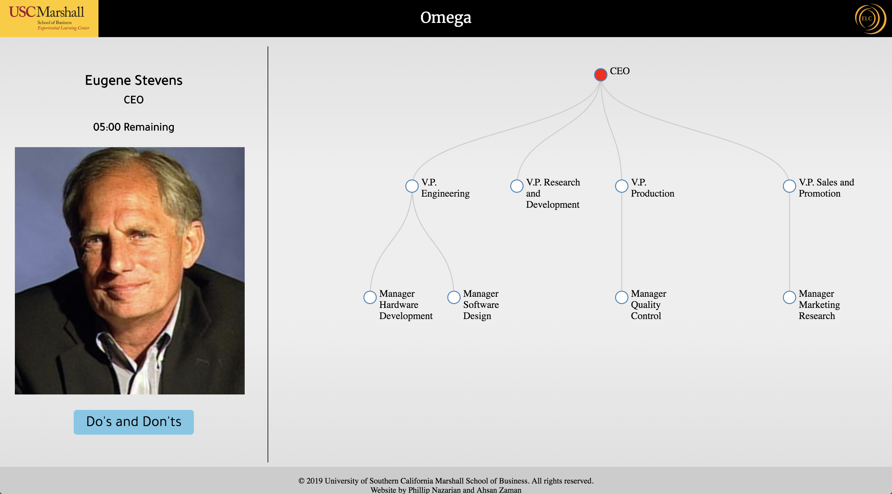

# Omega Interviewer

Omega Interviewer is a web application built on top of the [Interviewer](https://github.com/pmnazari/Interviewer) library.

Docs generated by JSDoc are in /docs. Use the command "jsdoc -c docs/conf.json" to re-generate.

Created by Phillip Nazarian and Ahsan Zaman in 2018.

